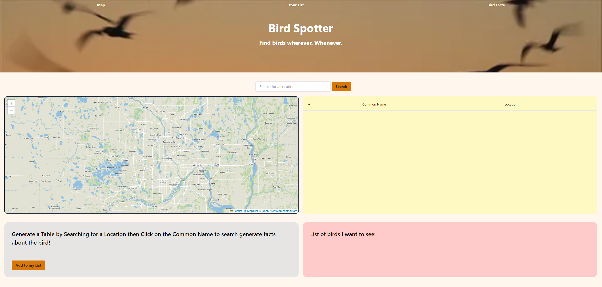

# Bird Spotter

## Description
The bird sighting website was created to locate birds in any area and get information about them. Within this website you can locate birds and information along side it, as well as creating your very own bird list.

## Installation

N/A

## Usage

On webpage load, the landing page contains a navigation bar with links to the map, a list of saved birds, and bird facts. The search bar is located in the middle of the screen with a map on the left and a table to the right of it. A bird fact container is located underneath the map and a list of birds you add to the list are to the right of that.

To get started type in a city in the search box and hit search. Then you can see all the birds in that given location.

If you want to see information about the bird click on the common name of the bird and under the map some information about the bird will appear.

To add it to the list just click the "Add to my list" button. The bird will be added to the your list in the red box to the right of the fact box. The added birds will be loaded on webpage load.

If the bird was already seen, click on the checkbox to cross the bird out.

To remove the bird from the list click on the red box with the X to the right of the bird in the list. This will delete the bird from local storage and the list.

## Screenshot

## Links
 [Link to deployed application](https://mjkonkel.github.io/bird-tracker/)

## Credits
### Mitchell Konkel
[Mitchell Konkel GitHub](https://github.com/mjkonkel)
### Nam Bui
[Nam Bui GitHub](https://github.com/nambui17)
### Tyler Van Meveren
### William Hirsch

## License

MIT License. Please refer to LICENSE in the repository.

## Badges

